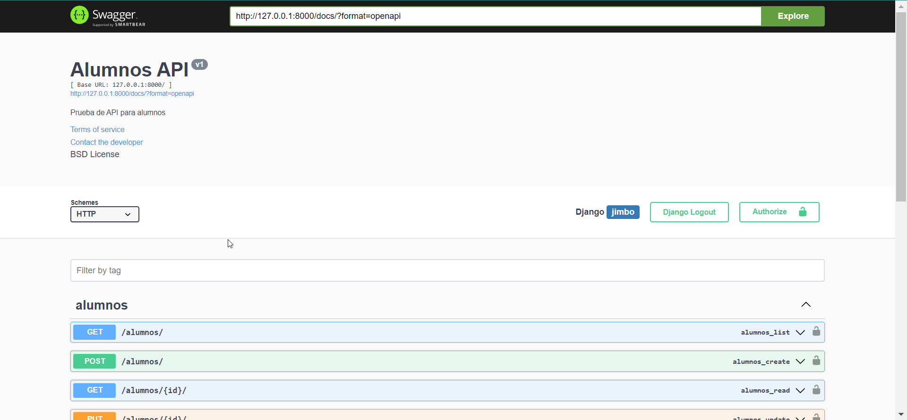

# Proyecto de Gestión de Alumnos con Django

Este proyecto Django REST FRAMEWORK proporciona una aplicación web para la gestión de alumnos, incluyendo funcionalidades como crear, editar y visualizar información de alumnos.

## Instalación

1. **Clona el repositorio:**

   ```bash
    git clone https://github.com/tu-usuario/proyecto-gestion-alumnos-django.git
    pip install -r requirements.txt
    python manage.py migrate

    python manage.py runserver

## Vista previa

